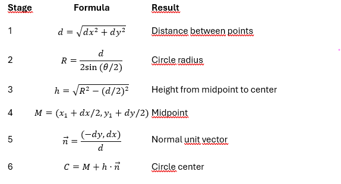

# ZX-Plot
Fast plot routine using LUT to replace the original ROM

Graphic routine in assembler (Z80) for plotting pixels with ZX Spectrum.

The Plot subroutine - Replace the one in the ROM @ $22E5; Fits in the space of the original (excluding the LUT)

A screen byte holds 8 pixels so it is necessary use a mask to leave the other 7 pixels unaffected.
In this version I use a LUT to grab the mask.
All 64 pixels in the character cell take any embedded colour items.
A pixel can be reset (inverse 1), toggled (over 1), or set ( with inverse and over switches off).
With both switches on, the byte is simply put back on the screen though the colours may change.

# ZX-Circle
Fast circle routine to replace the original ROM

Graphic routine in assembler (Z80) for drawing circles  with ZX Spectrum.

The Circle subroutine - Replace the one in the ROM @ $2320; Fits in the space of the original

The exact definition of a circle centered at the origin is:

x^2+y^2=r^2

Solving for y gives y=± SQR (r^2−x^2)
Because of symmetry, we can mirror the solution (x,y) pairs we get in Quadrant I into the other quadrants. 

The algorithm used is the “Midpoint Circle Algorithm”

- Start out from the top of the circle (pixel (0,r)). 
- Move right (east (E)) or down-right (southeast (SE)), whichever is closer to the circle.
- Stop when x=y
- This implementation gives a more aesthetically pleasing circle than the one in the original ROM. 
 
# ZX-Arc

Arc: New Arc algorithm
Classic geometric algorithm for drawing a circular arc from two points and an angle (DRAW x,y,a),
using the center of the circle.

               
              C (center) 
             /|\
            / | \
           /  |  \
          /   |   \
         /    h    \
        /     |     \
       P1-----M-----P2
          d/2    d/2
       <------d------>
              
- d = distance (P1,P2)
- R = circle radius
- h = distance from center C to the line P1P2 (chord height)
- θ is the central angle subtended by the chord P₁–P₂, that is, the angle ∠P₁CP₂.

Algorithm Objective

Given:
- Starting point: P1 = (x1, y1) 
- Ending point: P2 = (x2, y2) 
- With center C and radius R, draw the arc from P1 to P2 with angle θ.

# SAM RND on the ZX Spectrum
Fast SAM ROM routine by Andrew J. A. Wright (1989–1990) to replace the original in the ZX ROM

This RND implementation is designed to replace the original Sinclair Research ZX Spectrum version, delivering over 5× higher performance while relying exclusively on integer arithmetic. It preserves a similar algorithmic structure and statistical properties to the original implementation.

Many classic computers and systems used Linear Congruential Generators (LCGs) because they are simple, fast, and require very little memory. The Sinclair Research ZX Spectrum and the Miles Gordon Technology SAM Coupé are notable examples, both employing Lehmer-style multiplicative generators derived from the LCG family. Other well-known systems also relied on LCGs, including the Microsoft Microsoft C runtime rand() implementation, early IBM mainframe libraries, numerous Unix standard library implementations, and early video game consoles and home computers where computational efficiency was critical. Even today, LCGs remain useful in lightweight simulations, procedural generation, and embedded systems where deterministic behavior and minimal overhead are more important than cryptographic strength.

**LCG Algorithm - Linear Congruential Generator**

X(n+1) = (a * X(n) + c) mod m

_m_ (Modulus): Defines the maximum period (how many numbers are generated before the sequence repeats).
_a_ (Multiplier): Determines how well the values are distributed throughout the sequence.
_c_ (Increment): When _c = 0_, the generator is called a Multiplicative Congruential Generator, also known as a Lehmer generator.

**SAM Coupé RND Generator**

The RND routine originally proposed and used in the SAM Coupé employs an LCG with modulus 65537 (the Fermat prime F4 = 2^16 + 1), multiplier 254, and increment 253. This differs from the ZX Spectrum implementation, which uses multiplier 75 and increment 0.

The recurrence can be written as:

**X(n+1) = (254 * (X(n) + 1) mod 65537) - 1**

or equivalently:

**X(n+1) = (254 * X(n) + 253) mod 65537**

**ZX Spectrum RND Generator**

The Sinclair Research ZX Spectrum (1982) uses a Lehmer-style multiplicative generator. It operates on 16-bit values, using the Fermat prime F4 = 65537 as modulus and 75 as a primitive root modulo 65537.

The core formula used in the original ZX ROM is:

**X(n+1) = ((75 * (X(n) + 1)) mod 65537) - 1**

**Why 65537?**

A Fermat prime has the form:  _2^(2^n) + 1_. For _n = 4: 2^16 + 1 = 65537_. This is the largest known Fermat prime.

If _m = 65537_ (a prime number) is used together with a multiplier a that is a primitive root modulo _65537_ (such as 75 or 254), the generator cycles through all 65,536 possible non-zero states before repeating, achieving the maximum possible period.

**Primitive Root Modulo 65537**

Saying that 75 or 254 is a primitive root modulo 65537 means that successive powers:

_g_^1, _g_^2, _g_^3, ...

taken modulo 65537 generate every integer from 1 to 65536 exactly once before the cycle repeats.

This guarantees full traversal of the multiplicative group and therefore maximum period for the generator.

**Optimization Trick - Multiplication by 254 without MUL**

A useful identity is:

254 * (X + 1) = 256 * (X + 1) - 2 * (X + 1)

On a 16-bit machine, multiplying by 256 is simply an 8-bit left shift (or byte rotation): the low byte L becomes the high byte H, and the new low byte becomes 0.

This allows multiplication by 254 to be implemented efficiently using shifts, subtraction, and carry handling, avoiding a costly general-purpose multiplication routine.

# Assembling

The source code is a .asm text file that can be compiled with a Z80 assembler like sjasmplus or other, and run in a Spectrum emulator like the Fuse or Spetaculator. 
Run the assembler with:

sjasmplus --lst=zxrom.lst zxplot.asm

Sjasmplus is a command-line cross-compiler of assembly language for [Z80 CPU](https://en.wikipedia.org/wiki/Zilog_Z80).

Supports many [ZX-Spectrum](https://en.wikipedia.org/wiki/ZX_Spectrum) specific directives, has built-in Lua scripting engine and 3-pass design.

